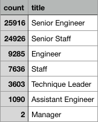
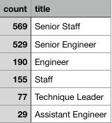
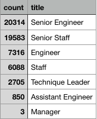

# Pewlett Hackard Analysis

## Overview of Pewlett Hackard Analysis
A hypothetical large company called Pewlett Hackard has been in business for a long time and has thousands of employees.  The company is preparing for a wave of retiring employees affectionately reffered to as the 'Silver Tsunami' because most of employees are  part of the 'baby boomer' era.  These retirements will cause thousands of job openings all at the same time which could put a strain on the company.  We were tasked with using 6 csv files regarding employee data to organize the data using PostreSQL and compile various tables to display data on the 'Silver Tsunami'.  The goal of this challenge was to determine the number of retiring employees per title and identify employees who are eligible to participate in a mentorship program.  The mentorship program is a chance for employees to learn how to take over positions of retiring employees in high ranking posts. The age parameters behind tabulating retiring employees are those who were born between January 1, 1952 and December 31, 1955. The age parameters for employees eligible for the mentorship program are those born between January 1, 1965 and December 31, 1965.

## Results of Pewlett hackard Analysis
<ul>
  <li> <b>How many retiring employees are there per title?</b>
    <ul>
      <li> The table with the count of retiring employees per title:
        

            
        

      </li>
      <li>  Again, these employees are gathered based on a birth date occuring between January 1, 1952 and December 31, 1955. The total count of retiring employees is 72,458. 
      </li>
    </ul>
  </li>
  <li> <b>How many employees are eligible for the Mentorship program?</b>
    <ul>
      <li> The table with the count of eligible employees per title:
        

            
        

      </li>
      <li>  Again, these employees are gathered based on a birth date occuring between January 1, 1965 and December 31, 1965.The total count of retiring employees is 1,549.
      </li>
    </ul>
  </li>
</ul>

## Summary of Pewlett hackard Analysis
<b>How many Roles will need to be filled as the 'silver tsunami" begins to make an impact?</b>
Even if the retirements are spread over 3 or 4 years, thats around 20 thousand new employees every year, most of which are the highest ranking positions.  This could cause a cascading failure throughout the company.

<b> Are there enough qualified, retirement-ready employees in the departments to mentor the next generation of Pewlett Hackard employees?</b>
I must admit , this question seems odd.  It's obvious there are plenty of retirement ready employees to mentor other employees;  however, the amount of employees that are eleigible based on the birth date range is nowhere near enough.  1,549 employees can't take over more than 5% of one of the senior ranking positions. 

In order to see if more employees could be eligible with a broader range, I looked at the amount of employees with birth dates between 1965 and 2970 but the numbers were the same.  So I look for anyone born after 1965 and there are none.  The fact that the employee pool to work with is only 10 years before retirement seems extremely unsustainable. I did change the birth date range to between January 1, 1962 and December 31, 1965 and  got a much more reasonable number of eligible employees.
The table with the count of eligible employees per title born between 1962 and 1965:

     

There are 56,859 employees in this age range. In terms of taking over higher possitions, this is the range that works best in relation to the amount of retiring employees.  The biggest issue however, is that there is no one bornb after 1965.  This means that even the youngest employee is already 55 years old.  This obviously could be an error with the data created for this project, but it's important to point out that the company needs to hire younger people if it hopes to last.  
      

